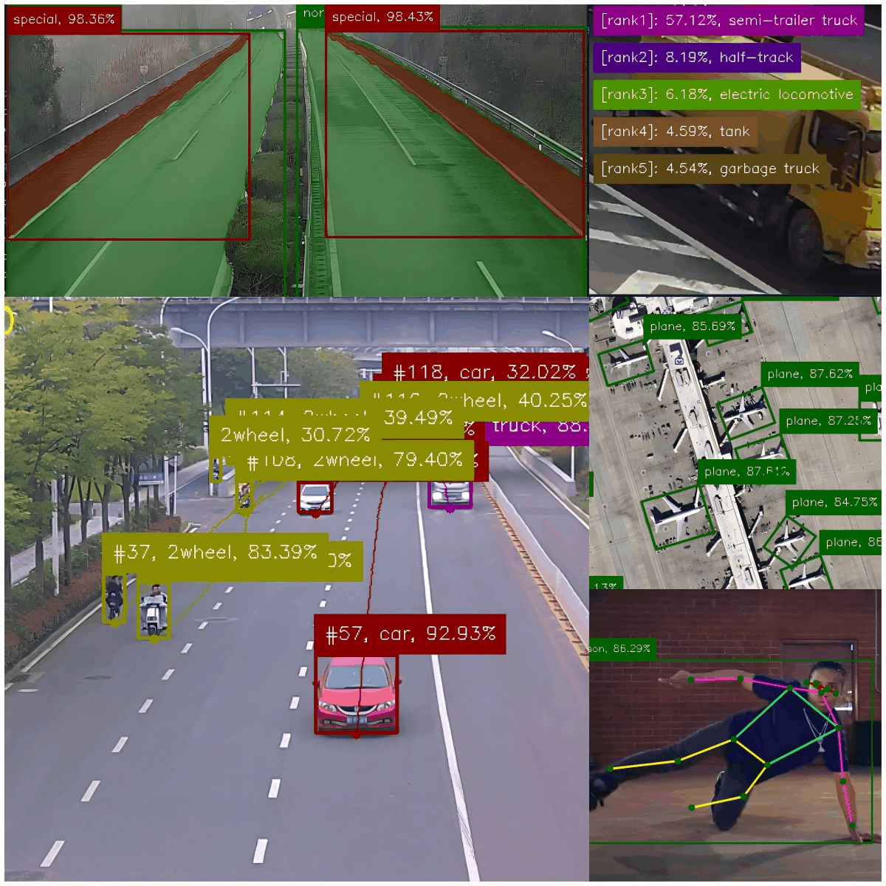

<p style="" align="center">
  
</p>
<p style="margin:0px;color:gray" align="center">
[🚀All Yolo Tasks. 🚀All Yolo Versions. 🚀All Yolo Runtimes.]
</p>

# one-yolo
A unified C++ toolkit for YOLO `v5/v8/v11/v26/...`, covering `classification/detection/segmentation/pose/obb` tasks with easy python-like APIs from `ultralytics/ultralytics`. Support `All Yolo Tasks, All Yolo Versions, All Yolo Runtimes`, it's time to make all in one.
<p style="" align="center">
  
</p>

## highlight
1. support all `Yolo` tasks including `classification`/`detection`/`segmentation`/`pose`/`obb`.
2. support all `Yolo` versions including `yolov5(anchor-based)`/`yolov5u(anchor-free)`/`yolov8`/`yolov11`/`yolov26(nms-free)`/`more in the future`, sub versions like `n/s/m/l/x` are also supported.
3. support all `Yolo` inference backends(runtime) such as `OpenCV::DNN`/`ONNXRuntime`/`TensorRT`/`OpenVINO`/`RKNN`/`CoreML`/`CANN`/`PaddlePaddle`...
4. easy APIs to use and integrate, as simple as python APIs from `ultralytics/ultralytics` library.
5. toolkit works out of box, provide the model and set up the config parameters, go predict!

## quick start

### basics
1. C++ >= 17
2. GCC >= 7.5
3. OpenCV == 4.13
4. CUDA/ONNXRuntime/TensorRT/OpenVINO/RKNN/... are optional

### build
1. run `git clone https://github.com/sherlockchou86/one-yolo.git`
2. run `cd one-yolo && mkdir build && cd build`
3. run `cmake .. && make -j8` or click `debug` button to run samples directly if you have opened the project using VS Code

> you must put test data(models&video&images) at the same directory as one-yolo first before runing the samples.

```
build options when run cmake command:
-DBUILD_WITH_ORT=ON   # enable ONNXRuntime as inference backend
-DBUILD_WITH_OVN=ON   # enable OpenVINO as inference backend
-DBUILD_WITH_TRT=ON   # enable TensorRT as inference backend
-DBUILD_WITH_RKN=ON   # enable RKNN as inference backend
-DBUILD_WITH_CML=ON   # enable CoreML as inference backend
-DBUILD_WITH_PDL=ON   # enable PaddlePaddle as inference backend
-DBUILD_WITH_CAN=ON   # enable CANN as inference backend
...

if you just run `cmake ..` without any options, 
one-yolo will depend on OpenCV::DNN module as inference backend by default,
so OpenCV is required for one-yolo, CUDA is optional when building OpenCV from source code. 
```

### hello one-yolo

vehicle detection & tracking task using `yolov8s`:
```c++
#include "Yolo.h"
#include "track/YoloTracker.h"
using namespace yolo;

int main() {
    /* 1. construct YoloConfig */
    YoloConfig cfg;
    cfg.desc        = "vehicle detection task using yolov8s(custom model)";
    cfg.version     = YoloVersion::YOLO8;
    cfg.task        = YoloTaskType::DET;
    cfg.target_rt   = YoloTargetRT::OPENCV_CUDA;
    cfg.model_path  = "./vp_data/models/det_cls/vehicel_v8s-det_c6_20260205.onnx";
    cfg.input_w     = 640;
    cfg.input_h     = 384;
    cfg.batch_size  = 1;
    cfg.num_classes = 6;
    cfg.names       = {"person", "car", "bus", "truck", "2wheel", "other"};

    /* 2. create Yolo using YoloConfig */
    auto model = Yolo(cfg);
    model.info();

    /* 3. construct YoloTrackConfig */
    YoloTrackConfig t_cfg;
    t_cfg.algo = YoloTrackAlgo::SORT;
    t_cfg.iou_thresh = 0.6f;

    /* 4. create YoloTracker using YoloTrackConfig */
    auto tracker = YoloTracker(t_cfg);
    tracker.info();

    /* 5. open video and predict frames in a loop */
    cv::VideoCapture cap("./vp_data/test_video/rgb.mp4");
    while (cap.isOpened()) {
        // collect frame
        cv::Mat frame;
        if (!cap.read(frame)) {
            cap.set(cv::CAP_PROP_POS_FRAMES, 0);
            continue;
        }

        // resize original image
        if (frame.cols > 720) {
            cv::resize(frame, frame, cv::Size(), 0.5, 0.5);
        }
        
        // predict with batch mode (batch size == 1)
        auto results = model(std::vector<cv::Mat>{frame});

        // track result
        tracker(results[0]);

        // show and print
        results[0].info();           // print summary
        results[0].to_json(true);    // convert structured result to json and print
        results[0].to_csv(true);     // convert structured result to csv and print
        if (results[0].show(
            false, 1.0f, DrawParam(), // show annotated image & input image(640*384) & original image with unblock mode
            true, true) == 27) {      // exit loop if user has pressed ESC
            break;
        }

        /*
         * you can also get structured results like below:
         * auto boxes        = results[0].boxes();          // get bounding boxes in detection task
         * auto cls_ids      = results[0].cls_ids();        // get class ids in detection task
         * auto confs        = results[0].confs();          // get confidences in detection task
         * auto labels       = results[0].labels();         // get labels in detection task
         * auto track_ids    = results[0].track_ids();      // get track ids in detection task
         * auto track_points = results[0].track_points();   // get track points in detection task
        */
    }
}
```
### demo video
video result of vehicle detection & tracking using yolov8s:

https://github.com/user-attachments/assets/d8b0b711-8922-41f8-8ec7-d1cea1f48afc

### demo output
json/csv output result of vechile detection & tracking using yolov8s:
```
json output:
[
    {
        "box": {
            "height": 76,
            "width": 33,
            "x": 368,
            "y": 378
        },
        "cls_id": 4,
        "conf": 0.8655326962471008,
        "label": "2wheel",
        "track_id": 1
    },
    {
        "box": {
            "height": 21,
            "width": 10,
            "x": 647,
            "y": 145
        },
        "cls_id": 4,
        "conf": 0.8104556202888489,
        "label": "2wheel",
        "track_id": 37
    },
    {
        "box": {
            "height": 15,
            "width": 9,
            "x": 676,
            "y": 137
        },
        "cls_id": 4,
        "conf": 0.7772445678710938,
        "label": "2wheel",
        "track_id": 23
    },
    {
        "box": {
            "height": 14,
            "width": 7,
            "x": 710,
            "y": 118
        },
        "cls_id": 4,
        "conf": 0.523908257484436,
        "label": "2wheel",
        "track_id": 41
    },
    {
        "box": {
            "height": 14,
            "width": 12,
            "x": 793,
            "y": 93
        },
        "cls_id": 3,
        "conf": 0.5332302451133728,
        "label": "truck",
        "track_id": 44
    },
    {
        "box": {
            "height": 128,
            "width": 113,
            "x": 494,
            "y": 369
        },
        "cls_id": 1,
        "conf": 0.9514954090118408,
        "label": "car",
        "track_id": 5
    },
    {
        "box": {
            "height": 9,
            "width": 13,
            "x": 721,
            "y": 117
        },
        "cls_id": 1,
        "conf": 0.7941694259643555,
        "label": "car",
        "track_id": 25
    },
    {
        "box": {
            "height": 9,
            "width": 14,
            "x": 753,
            "y": 116
        },
        "cls_id": 1,
        "conf": 0.7911720871925354,
        "label": "car",
        "track_id": 13
    },
    {
        "box": {
            "height": 11,
            "width": 13,
            "x": 770,
            "y": 107
        },
        "cls_id": 1,
        "conf": 0.5813544988632202,
        "label": "car",
        "track_id": 42
    }
]
csv output:
id,cls_id,conf,label,track_id
1,4,0.865533,2wheel,1
2,4,0.810456,2wheel,37
3,4,0.777245,2wheel,23
4,4,0.523908,2wheel,41
5,3,0.53323,truck,44
6,1,0.951495,car,5
7,1,0.794169,car,25
8,1,0.791172,car,13
9,1,0.581354,car,42
```
## references
wait for update
1. docs
2. samples
3. to-do
