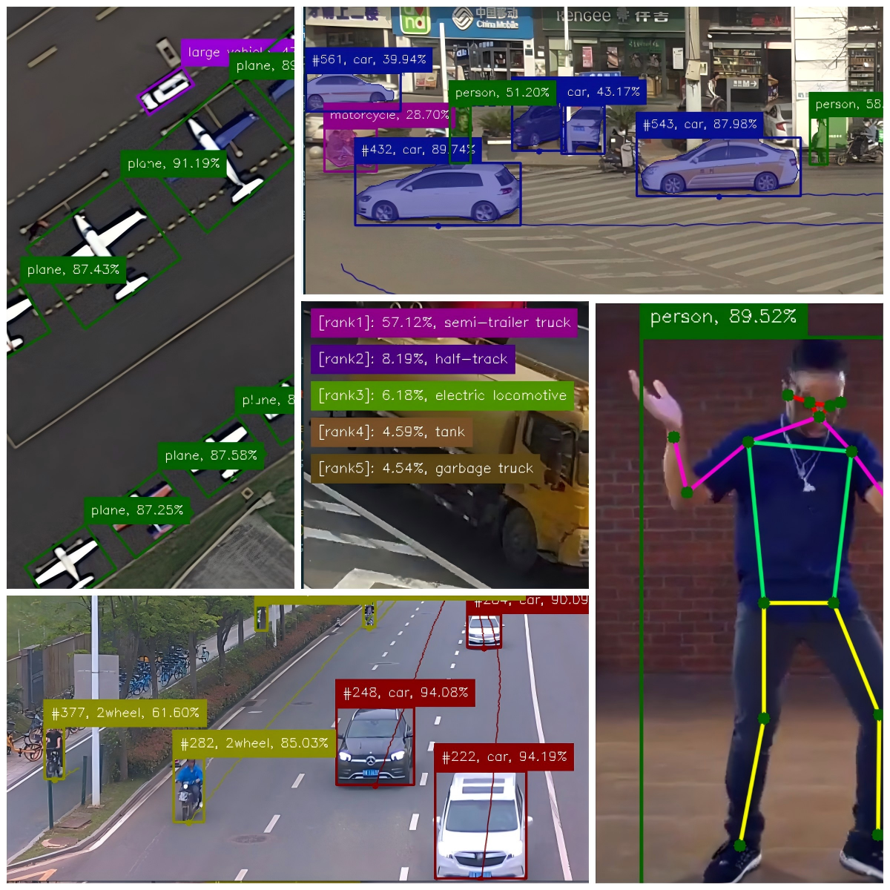

<p style="" align="center">
  
</p>
<p style="margin:0px;color:gray" align="center">
[Make All In One, Make All Easy.]
</p>

# one-yolo
A unified C++ toolkit for YOLO `v5/v8/v11/v26/...`, covering `classification/detection/segmentation/pose/obb` tasks with easy python-like APIs from `ultralytics/ultralytics`.
<p style="" align="center">
  
</p>

## highlight
1. support all `Yolo` tasks including `classification`/`detection`/`segmentation`/`pose`/`obb`.
2. support all `Yolo` versions including `yolov5(anchor-based)`/`yolov5u(anchor-free)`/`yolov8`/`yolov11`/`yolov26(nms-free)`/`more in the future`, sub versions like `n/s/m/l/x` are also supported.
3. support different inference backends such as `opencv::dnn`/`onnxruntime`/`tensorrt`/`openvino`/...
4. easy APIs to use and integrate, as simple as python APIs from `ultralytics/ultralytics` library.
5. toolkit works out of box, provide the model and set up the config parameters, go predict!

## quick start

### basics
1. C++ >= 17
2. OpenCV == 4.13
3. Cuda/ONNXRuntime/TensorRT/OpenVINO/RKNN/... are optional

### build
1. run `git clone https://github.com/sherlockchou86/one-yolo.git`
2. run `cd one-yolo && mkdir build && cd build`
3. run `cmake .. && make -j8` or click `debug` button directly if you have opened the project using VS Code

> you must put test models and test images/video at the same directory as one-yolo first.

### hello one-yolo

vehicle detection & tracking task using `yolov8s`:
```c++
#include "Yolo.h"
#include "track/YoloTracker.h"
using namespace yolo;

int main() {
    /* 1. construct YoloConfig */
    YoloConfig cfg;
    cfg.desc        = "vehicle detection task using yolov8s(custom model)";
    cfg.version     = YoloVersion::YOLO8;
    cfg.task        = YoloTaskType::DET;
    cfg.target_rt   = YoloTargetRT::OPENCV_CUDA;
    cfg.model_path  = "./vp_data/models/det_cls/vehicel_v8s-det_c6_20260205.onnx";
    cfg.input_w     = 640;
    cfg.input_h     = 384;
    cfg.batch_size  = 1;
    cfg.num_classes = 6;
    cfg.names       = {"person", "car", "bus", "truck", "2wheel", "other"};

    /* 2. create Yolo using YoloConfig */
    auto model = Yolo(cfg);
    model.info();

    /* 3. construct YoloTrackConfig */
    YoloTrackConfig t_cfg;
    t_cfg.algo = YoloTrackAlgo::SORT;
    t_cfg.iou_thresh = 0.6f;

    /* 4. create YoloTracker using YoloTrackConfig */
    auto tracker = YoloTracker(t_cfg);
    tracker.info();

    /* 5. open video and predict frames in a loop */
    cv::VideoCapture cap("./vp_data/test_video/rgb.mp4");
    while (cap.isOpened()) {
        // collect frame
        cv::Mat frame;
        if (!cap.read(frame)) {
            cap.set(cv::CAP_PROP_POS_FRAMES, 0);
            continue;
        }

        // resize original image
        if (frame.cols > 720) {
            cv::resize(frame, frame, cv::Size(), 0.5, 0.5);
        }
        
        // predict with batch mode (batch size == 1)
        auto results = model(std::vector<cv::Mat>{frame});

        // track result
        tracker(results[0]);

        // show and print
        results[0].info();           // print summary
        results[0].to_json(true);    // convert structured result to json and print
        results[0].to_csv(true);     // convert structured result to csv and print
        if (results[0].show(
            false, 1.0f, DrawParam(), // show annotated image & input image(640*384) & original image with unblock mode
            true, true) == 27) {      // exit loop if user has pressed ESC
            break;
        }

        /*
         * you can also get structured results like below:
         * auto boxes        = results[0].boxes();          // get bounding boxes in detection task
         * auto cls_ids      = results[0].cls_ids();        // get class ids in detection task
         * auto confs        = results[0].confs();          // get confidences in detection task
         * auto labels       = results[0].labels();         // get labels in detection task
         * auto track_ids    = results[0].track_ids();      // get track ids in detection task
         * auto track_points = results[0].track_points();   // get track points in detection task
        */
    }
}
```

## references

1. docs
2. samples
3. to-do